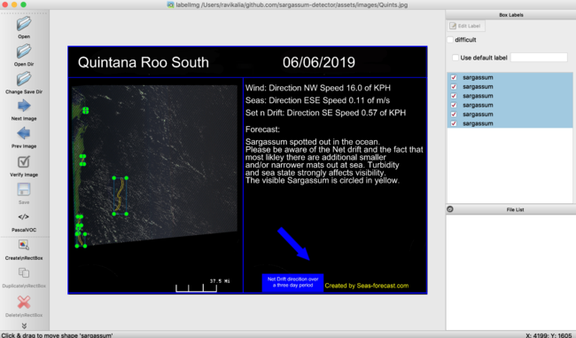
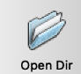
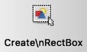
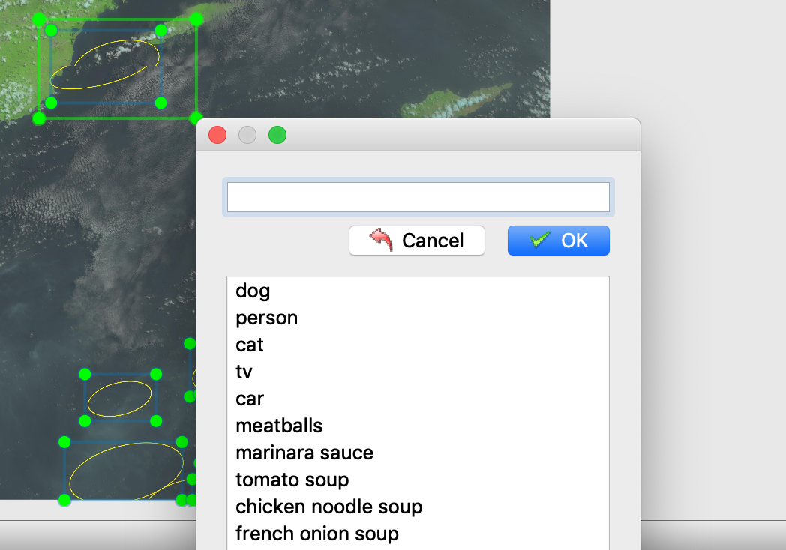
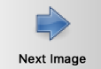

**NOTE**: **This is a Work In Progress - the notebook magic shell commands need to be replaced with python subprocess module commands and the API still needs to be completed**

<h1 align="center"> Object Detector </h1> <br>
<p align="center">
  <a href="https://en.wikipedia.org/wiki/Sargassum#Sargassum_crisis_in_the_Caribbean_Sea">
    
  </a>
</p>

<p align="center">
  Object Detector for "monster seaweed" (sargassum) - the one ruining the Caribbean.
</p>

[](https://forthebadge.com)
[](https://forthebadge.com)
[](https://forthebadge.com)
[](https://forthebadge.com)


A project that builds a "monster seaweed" (sargassum) detector with a one stage fast detector along with a [review](./papers/focal_loss_for_dense_object_detection_review.ipynb) on the [seminal paper](https://arxiv.org/abs/1708.02002) that enables this technique with focal loss technology.

---

## Buy Me a Coffee

Whether you use this project, have learned something from it, or just like it, please consider supporting it by buying me a coffee, so I can dedicate more time on open-source projects like this :)

<a href="https://www.buymeacoffee.com/7TpBbiS" target="_blank"></a>

---

## Table of Contents

[TL;DR](#tldr)

* [Introduction](#Introduction)
* [Features](#Features)
* [Setup](#Setup)
* [Usage](#Usage)
* [Built With](#Built-With)
* [To Do](#To-Do)
* [Feedback](#Feedback)
* [Thanks](#Thanks)
* [License](#License)

---

## TL;DR

The objective of this repo is to parse LANDSAT satellite screenshot images and detect bounding boxes for signicant amounts dangerous species of seaweed - saragassum. It contains a ready to detect SargassumNET trained network. (One issue is that the sargassum mats are marked - not labeled - by altering the pixels on the images with yellow lines - with unmarked images we could learn to predict sargassum from. )

---

## Introduction

Sargassum excess has become an ecological, tourism, contamination and health crisis around the Caribbean and Gulf of Mexico and recently the West Coast of Africa - resulting in trillions of dollars of lost economic activity.

<p align="center">
  <a>
    
     
  </a>
</p>

Once the sargassum hits beaches in large quantities it can be too late. By then the waters turn brown, black and dangerous due to the gases that decaying sargassum release.

A possible use for this technology is to have it linked to some sea based excavation tools (such as the barges used by the Mexican marines) to remove the sargassum. Another is to locate and treat sargassum growth sites.

---

## Getting Started

To get started using this repo to detect sargassum you'll need to:

* have a google colab account
* clone this repo
* have image data that the detector will run on
* have network access to download the trained network

To train your own detector in addition you'll need:

* a backbone network for the retinanet
* a dataset to train later layers of retinanet
* enough compute to train the model - google colab is great for this
* [labelImg](https://github.com/tzutalin/labelImg) tool to add labels to the image data
* local Python3 runtime with GUI to label the data

---

## Software Features

This detector does:

* classify instances of sargassum on landsat screenshot image data.
* localize tight bounding boxes for the classified sargassum instances.
* provide high performance
* run quickly

---

## Setup

There is one Google [colab notebook](https://colab.research.google.com/drive/19JK7eyUbTm1yYbBGiC76sT3ZyWJRxwvp) which makes use of google's cloud features - including google drive and GPU access.

Once you are running in google colab with access to datasets, all that is needed is to run:

* labeling package locally
* training section of colab notebook if training on new data
* detecting section of colab notebook if detecting on new data

To label data, some local software installations are needed.

### LabelImg Installation

Follow installation instructions of the [project](https://github.com/tzutalin/labelImg). 

on OSX the installation commands are:

```
pip3 install pyqt5 lxml # Install qt and lxml by pip
make qt5py3
```

---

## Usage

Here is how to label, train and detect using this framework

### Labeling

#### Instructions

1. Run `python3 labelImg.py`. 

2. A QT window pops open. 



3. click the button "open dir" in the left toolbar of the window to navigate to the `training_data` directory. 



4. An image will display in the window for the first image file in the training_data. Repeat the following:

    1. Select a sargassum instance. Zoom in from the top menu if necesary.

    2. On the left side tool bar, you see a 'Create\RecBox' icon. Click it and go over to the image in the window. 
    

    3. Draw a rectangle by depressing the trackpad/mouse until you have a tight box around the sargassum instance.
    
    4. A pop up prompts for a label. At the first labelling you need to type in the label for sargassum. After that it is the default. Select the label and hit enter. 
    
    
    5. Repeat until all sargassum instances on the image have been labeled.
    
    6. Save the label file once done by clicking the save icon.
    
    7. Use the left toolbar, click Next Image icon 
    
    

5. Repeat step 4 until all images in the training data have been completed.

### Training

To train the detector with new data either use the Jupyter Notebook or Python API in google colab.

#### Jupyter Notebook

##### Instructions

* Have the training image files in a local directory 
* Upload files to google colab - google drive is good for getting files from your local runtime to the cloud
* Run the training section of the [notebook](https://colab.research.google.com/drive/19JK7eyUbTm1yYbBGiC76sT3ZyWJRxwvp)
* Store trained models on google drive

#### Python API

##### Instructions

Run 

```
python3 ./src/utils/api_train.py --training_data path/to/training_data --hyperparameters hyperparameters_dict
```

### Detecting On New Images

To detect on new images either use Jupyter Notebook or the Python API in google colab.

#### Jupyter Notebook

##### Instructions

* Run the detection part of the [notebook](https://colab.research.google.com/drive/19JK7eyUbTm1yYbBGiC76sT3ZyWJRxwvp) - this needs the installation to have been run first
* Provide credentials when prompted to access storage
* Upload new image file when prompted


### Python API

##### Instructions

Run 

```
python3 ./src/utils/api_inference.py --trained_model path/to/trained_model --inpath inpath/to/test/data --outpath dir/to/save/inferred/image --classes  path/to/classes/file --threshold threshold 
```

---

## Built With

This is a Python3 project built with the following tools as well as modules from the python Machine Learning ecosystem:

* [Jupyter Notebook](https://jupyter.org/)
* [Google Colab](https://colab.research.google.com/) Cloud Computing Platform
* [Google Drive](https://drive.google.com/) Storage
* [keras-retinanet](https://github.com/fizyr/keras-retinanet)
    * which depends on [Tensorflow](https://www.tensorflow.org/), [Keras](https://keras.io/) and [sklearn](https://scikit-learn.org/)

---

## To Do

* Add images of results
* Add discussion of problem data - already marked on the image
* Add possible solutions and their drawbacks
* Add working api <— argparse
* Create release binary file of trained models hosted on github
* Add data to git LFS/Release
* Refactor code to work in directory structure of cookiecutter repo
* Change model paths to directories in models
* Add docstrings to functions
* Add unit testing to function

---

## Feedback

[1.1]: http://i.imgur.com/tXSoThF.png (twitter icon with padding)
[2.1]: http://i.imgur.com/0o48UoR.png (github icon with padding)
[1]: http://www.twitter.com/ravkalia1
[2]: https://github.com/marilyn-n

I'm open to suggestions, feel free to message me on [![@ravkalia twitter][1.1]][1]. Pull requests are also welcome!

---

## Credits

Thanks to [RomRoc](https://github.com/RomRoc) for his [tutorial](https://www.freecodecamp.org/news/object-detection-in-colab-with-fizyr-retinanet-efed36ac4af3/) on freecodecamp looking at focal loss and the full code pipeline that powers this project.

Thanks to the AI company [fizyr](https://fizyr.com/) for their open source [keras-retinanet](https://github.com/fizyr/keras-retinanet) repo which provides a great out of the box implementation of retinatnet.

Thanks to the folks over at [SEAS Forecast](http://seas-forecast.com/) for providing publicly available screenshots of marked [LANDSAT](https://landsat.gsfc.nasa.gov/) data.

Thanks to [@marilyn-n][2] for helping process and tag the raw image files.

---

## License

> You can check out the full license [here](https://github.com/project-delphi/object-detector/blob/master/LICENSE)

This project is licensed under the terms of the **MIT** license.