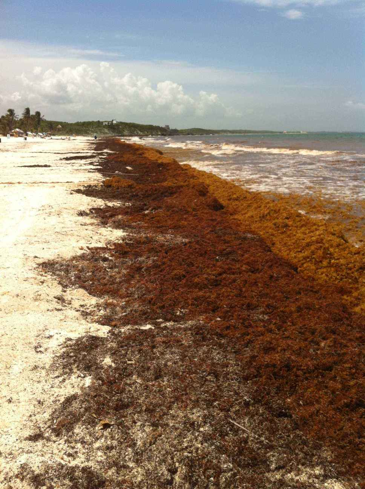

<h1 align="center"> Object Detector </h1>  

  

  Object Detector for "monster seaweed" (sargassum) - the one ruining the Caribbean.

A project that builds a "monster seaweed" (sargassum) detector with a one stage detector along with a review on the seminal paper that enables this technique with focal loss technology.

---

## Buy Me a Coffee

Whether you use this project, have learned something from it, or just like it, please consider supporting it by buying me a coffee, so I can dedicate more time on open-source projects like this :)

---

## Table of Contents

[TL;DR](#tldr)

* [Introduction](#Introduction)
* [Features](#Features)
* [Setup](#Setup)
* [Usage](#Usage)
* [Built With](#Built-With)
* [Credits](#Credits)
* [Feedback](#Feedback)
* [Thanks](#Thanks)
* [License](#License)

---

## TL;DR

The objective of this repo is to parse LANDSAT satellite screenshot images and detect bounding boxes for a signicant amounts dangerous species of seaweed - saragassum. It contains a ready to detect SargassumNET trained network. (One issue is that the sargassum mats are marked - not labeled - by altering the pixels on the images with yellow lines - with unmarked images we could learn to predict sargassum from)

---

## Introduction

Sargassum excess has become an ecological, tourism, contamination and health crisis around the Caribbean and Gulf of Mexico and recently the West Coast of Africa - resulting in trillions of dollars of lost economic activity.

  

Once the sargassum hits beaches in large quantities it can be too late. By then the waters turn brown, brackish, and dangerous due to the gases that decaying sargassum release.

A possible use for this technology is to have it linked to some sea based excavation tools (such as the barges used by the Mexican marines) to remove the sargassum. Another is to locate and treat sargassum growth sites.

---

## Getting Started

To get started using this repo to detect sargassum you'll need to:

* have a google colab account
* clone this repo
* have image data that the detector will run on
* have network access to download the trained network

To train your own detector in addition you'll need:

* a backbone network for the retinanet
* a dataset to train later layers of retinanet
* enough compute to train the model - google colab is great for this
* [labelImg](https://github.com/tzutalin/labelImg) tool to add labels to the image data
* local Python3 runtime with GUI to label the data

To evaluate test performance:

---

## Software Features

The features of this detector are:

* classify instances of sargassum on landsat screenshot image data.
* localize tight bounding boxes for the classified sargassum instances.
* to do this with a high accuracy

---

## Setup

Once you are running in google colab with access to datasets, all that is needed is to run the

* labeling notebook if labeling data
* training notebook if training on new data
* detecting notebook if detecting on new data

---

## Usage

Here is how to train and detect using this framework

### Training

To train the detector with new data, you need to:

* Have the training image files in a local directory 
* Run labelImg.py on the image files data to label the data
* Convert the labels xml file format to csv
* Upload files to google colab - google drive is good for getting files from your local runtime to the cloud
* Run the training notebook
* Store trained models on google drive

### Detecting On New Images

To detect on new images:

* Run the detection notebook
* Provide credentials when prompted to access storage
* Upload new image file when prompted

---

## Built With

This is a Python3 project built with the following tools as well as modules from the python Machine Learning ecosystem:

* [Jupyter Notebook](https://jupyter.org/)
* [Google Colab](https://colab.research.google.com/) Cloud Computing Platform
* [Google Drive](https://drive.google.com/) Storage
* [keras-retinanet](https://github.com/fizyr/keras-retinanet)
    * which depends on [Tensorflow](https://www.tensorflow.org/), [Keras](https://keras.io/) and [sklearn](https://scikit-learn.org/)

---

## Credits

object-detector is created and maintained by [Ravi Kalia](https://project-delphi.github.io/).

----

## Feedback

[1.1]: http://i.imgur.com/tXSoThF.png (twitter icon with padding)
[2.1]: http://i.imgur.com/0o48UoR.png (github icon with padding)
[1]: http://www.twitter.com/ravkalia1
[2]: https://github.com/marilyn-n

I'm open to suggestions, feel free to message me on [![@ravkalia twitter][1.1]][1]. Pull requests are also welcome!

---

## Thanks

Thanks to the folks over at [SEAS Forecast](http://seas-forecast.com/) for providing publicly available screenshots of marked [LANDSAT](https://landsat.gsfc.nasa.gov/) data.

Thanks to [@marilyn-n](2) for helping process and tag the raw image files.

Thanks to [RomRoc](https://github.com/RomRoc) for his [tutorial](https://www.freecodecamp.org/news/object-detection-in-colab-with-fizyr-retinanet-efed36ac4af3/) on freecodecamp looking at focal loss.

Thanks to [fizyr](https://fizyr.com/) for their [keras-retinanet](https://github.com/fizyr/keras-retinanet) repo which provides a great out of the box implementation of retinatnet.

---

## License

> You can check out the full license [here](https://github.com/project-delphi/object-detector/blob/master/LICENSE)

This project is licensed under the terms of the **MIT** license.